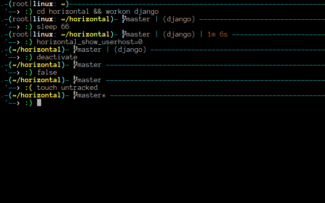

# Horizontal

2 lines ZSH prompt for developer




## Features

- Command execution time will be displayed if it exceeds the set threshold.
- Shows `git` branch and whether it's dirty.
- Shows a face icon represent last command exit status.
- Shows python `virtualenv` name.


## Installation

### [antigen](https://github.com/zsh-users/antigen)

Add `antigen bundle nuimk/horizontal` to your .zshrc file (do not use the `antigen theme` function).

### [oh-my-zsh](https://github.com/robbyrussell/oh-my-zsh)

Symlink (or copy) `horizontal.zsh` to `~/.oh-my-zsh/custom/horizontal.zsh-theme` and add `ZSH_THEME="horizontal"` to your `.zshrc` file.

### [prezto](https://github.com/sorin-ionescu/prezto)

Symlink (or copy) `horizontal.zsh` to `~/.zprezto/modules/prompt/functions/prompt_horizontal_setup` alongside Prezto's other prompts. Then `set zstyle ':prezto:module:prompt' theme 'horizontal'` in `~/.zpreztorc`.

### Manual install

1. Either
  - Clone this repo
  - add it as a submodule, or
  - just download `horizontal.zsh`

2. Symlink `horizontal.zsh` to somewhere in [`$fpath`](http://www.refining-linux.org/archives/46/ZSH-Gem-12-Autoloading-functions/) with the name `prompt_horizontal_setup`. Run `echo $fpath` to see possible locations.

3. Initialize the prompt system (if not so already) and choose `horizontal`:

    ```sh
    # .zshrc
    autoload -U promptinit && promptinit
    prompt horizontal
    ```


## Feature switchs

1 = enable
0 = disable

### `horizontal[cozy]=1`
Toggle a blank line before next prompt.

###  `horizontal[color]=1`
Toggle Black-and-white prompt

###  `horizontal[status]=1`
If set to zero, hide git, python virtual env and command execution time.

###  `horizontal[git]=1`
Display or hide git status

###  `horizontal[virtualenv]=1`
Display or hide python virtual environment name

###  `horizontal[userhost]=1`
Display or hide `user|host` in prompt

## Settings

Override default value of configurable settings

### `horizontal_cmd_max_exec_time=5`
The max execution time of a process before its run time is shown when it exits.


### Example

```sh
# .zshrc

# override default setting
horizontal_cmd_max_exec_time=10
horizontal[cozy]=1

autoload -U promptinit && promptinit
prompt horizontal
```

## Integrating with powerline fonts
For the nice looking powerline symbols to appear,
you will need to install a patched font. Instructions can be found
in the official powerline [documentation](https://powerline.readthedocs.org/en/latest/installation/linux.html#font-installation).
Prepatched fonts can be found in the [powerline-fonts](https://github.com/Lokaltog/powerline-fonts) repository.


## License

[MIT](http://opensource.org/licenses/MIT) Nui Narongwet

Inspired by adam2, based on [pure] (https://github.com/sindresorhus/pure) by sindresorhus

